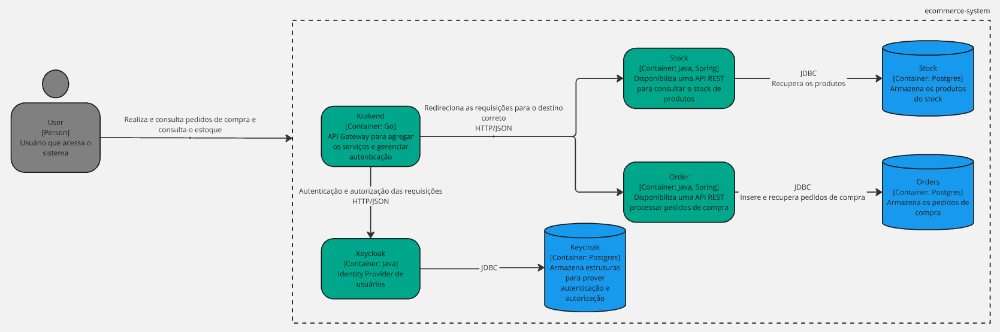

# api-gateway

POC para testar o KrakenD como Api Gateway

## Arquitetura

## Endpoints

Orders:

- GET <http://localhost:8080/ecommerce/v1/orders> ➜ GET <http://localhost:8080/orders>
- POST <http://localhost:8080/ecommerce/v1/orders/create-order> ➜ <http://localhost:8080/orders/create-order>

Stock:

- GET <http://localhost:8080/ecommerce/v1/stock> ➜ GET <http://localhost:8080/stock>
